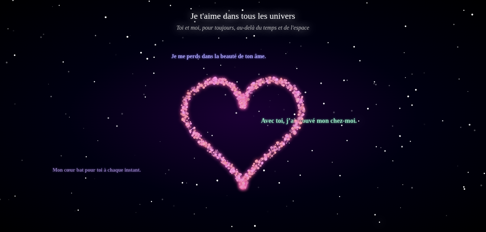

# Heart of Stars — Une carte cosmique interactive d'amour

Slogan : Une constellation de mots et de lumière pour célébrer l'apprentissage et la créativité.

## Description courte

« Heart of Stars » est une petite expérience web interactive créée pour tester des techniques d'animation Canvas, d'interaction utilisateur et de design visuel—le tout avec une touche romantique. Le projet affiche une constellation en forme de cœur, des étoiles scintillantes, des météores et des messages romantiques qui tombent doucement sur l'écran, accompagnés d'une piste audio.

## Description longue

Ce projet est un prototype statique (HTML/CSS/JavaScript) construit pour explorer :

- l'API Canvas pour dessiner et animer des milliers d'éléments légers (étoiles, météores, textes);
- la gestion d'interactions : clics, mouvements de souris et redimensionnement de la fenêtre;
- des effets visuels avec ombres, flou et couleurs HSLA pour créer une ambiance cosmique;
- l'intégration d'une piste audio de fond déclenchée par l'utilisateur.

Le résultat est une carte interactive et responsive qui réagit au mouvement de la souris, où un cœur se forme progressivement à partir d'étoiles et où des messages romantiques tombent et s'estompent.

Ce dépôt est conçu pour l'apprentissage et l'expérimentation — idéal comme mini-projet pour un portfolio ou pour étudier les bonnes pratiques d'animations performantes dans Canvas.

## Fonctions principales

- Constellation en forme de cœur composée d'« étoiles » animées et battantes.
- Étoiles d'arrière-plan scintillantes.
- Météores aléatoires traversant l'écran.
- Phrases romantiques qui tombent (texte animé) et s'estompent.
- Interaction souris : approche/repousse des étoiles selon la position du curseur.
- Clic sur la toile : génère des particules/étoiles supplémentaires et augmente légèrement la taille du cœur.
- Piste audio de fond (fichier local) lancée au premier clic (gestion du blocage d'autoplay).
- Responsive : s'adapte aux changements de taille de la fenêtre.

## Capture d'écran



## Installation (reproduction locale)

Prérequis : un navigateur moderne (Chrome, Firefox, Edge) et Git si tu veux cloner le dépôt.

Méthode recommandée — serveur HTTP local (évite les restrictions liées aux fichiers locaux et à l'audio) :

1. Cloner le dépôt (si tu l'héberges sur GitHub) :

```bash
git clone https://github.com/ao627515/heart_of_stars.git
cd gift
```

2. Lancer un serveur local simple (exemples) :

- Avec Python 3 :

```bash
python3 -m http.server 8000
# puis ouvrir http://localhost:8000 dans ton navigateur
```

- Avec Node (package "serve") :

```bash
npm install --global serve
serve -s . -l 8000
# puis ouvrir http://localhost:8000
```

3. Ouvrir `http://localhost:8000` (ou la racine du serveur) dans ton navigateur.

Remarque : ouvrir `index.html` directement (`file://`) peut fonctionner sur certains navigateurs, mais le comportement audio et certaines politiques de sécurité peuvent bloquer des ressources. L'utilisation d'un serveur local est donc recommandée.

## Utilisation

- Clique n'importe où sur la page pour autoriser la lecture de la musique de fond (les navigateurs bloquent souvent l'autoplay sans interaction explicite).
- Déplace la souris sur la toile pour voir les étoiles se repousser ou se regrouper légèrement.
- Clique sur la toile pour provoquer une petite explosion d'étoiles/particules et agrandir le cœur.
- Redimensionne la fenêtre pour voir le rendu s'adapter automatiquement.

### Comportements à observer

- Les messages romantiques tombent périodiquement.
- Des météores apparaissent aléatoirement.
- Le battement du cœur est simulé par une modulation de la position des étoiles.

## Architecture et fichiers clés

- `index.html` — point d'entrée, inclut la toile (`<canvas>`) et la piste audio.
- `assets/css/style.css` — styles globaux et animations CSS.
- `assets/js/main.js` — logique principale : génération des étoiles, animation Canvas, événements souris/clic/resize et gestion audio.
- `assets/audios/start_river_in_your_eyes.mpeg` — piste audio de fond (fichier local).

## Technologies et dépendances

- HTML5
- CSS3 (utilise la police `Pacifico` en police de style, prévoir d'ajouter Google Fonts pour l'usage exact)
- JavaScript (Canvas API)
- Aucune dépendance externe requise pour exécuter le projet (librairies tierces : 0)

## Bonnes pratiques & performances

- Le rendu essaie d'être léger (utilisation de primitives canvas simples). Si tu veux améliorer les performances sur des petits appareils :
  - réduire le nombre d'étoiles (paramètre dans `createHeartStars`),
  - limiter les appels à `measureText` ou mettre en cache les mesures,
  - réduire la fréquence de création des textes tombants (`setInterval` dans `main.js`).

## Contribution

Ce projet est conçu pour l'apprentissage — contributions bienvenues ! Voici comment :

1. Fork le dépôt.
2. Crée une branche nommée `feat/ma-fonction` ou `fix/quelque-chose`.
3. Fais tes modifications et commits clairs.
4. Ouvre une Pull Request décrivant les changements.

Suggestions d'améliorations faciles :

- Ajouter un bouton pour activer/désactiver la musique.
- Ajouter des contrôles (volume, vitesse de chute des textes, thèmes de couleur).
- Charger la police `Pacifico` proprement via Google Fonts.
- Ajouter tests ou une page de démo avec contrôles UI.

## Licence

Ce projet est fourni à des fins d'apprentissage et d'expérimentation.

Licence recommandée : MIT — voir `LICENSE` dans la racine du dépôt.

```
MIT License
Copyright (c) 2025 ao627515

Permission is hereby granted, free of charge, to any person obtaining a copy
of this software and associated documentation files (the "Software"), to deal
in the Software without restriction, including without limitation the rights
to use, copy, modify, merge, publish, distribute, sublicense, and/or sell
copies of the Software, and to permit persons to whom the Software is
furnished to do so, subject to the following conditions:

THE SOFTWARE IS PROVIDED "AS IS", WITHOUT WARRANTY OF ANY KIND, EXPRESS OR
IMPLIED, INCLUDING BUT NOT LIMITED TO THE WARRANTIES OF MERCHANTABILITY,
FITNESS FOR A PARTICULAR PURPOSE AND NONINFRINGEMENT. IN NO EVENT SHALL THE
AUTHORS OR COPYRIGHT HOLDERS BE LIABLE FOR ANY CLAIM, DAMAGES OR OTHER
LIABILITY, WHETHER IN AN ACTION OF CONTRACT, TORT OR OTHERWISE, ARISING FROM,
OUT OF OR IN CONNECTION WITH THE SOFTWARE OR THE USE OR OTHER DEALINGS IN THE
SOFTWARE.
```
